# Architecture

This document provides a detailed walkthrough of the GPT-2 model architecture, component relationships, and data flow as implemented in this repository.

---

## Table of Contents

- [High-Level System Overview](#high-level-system-overview)
- [Component Dependency Graph](#component-dependency-graph)
- [Model Architecture](#model-architecture)
  - [Token Embedding](#token-embedding)
  - [Positional Embedding](#positional-embedding)
  - [Multi-Head Causal Attention](#multi-head-causal-attention)
  - [Feed-Forward Network](#feed-forward-network)
  - [Transformer Block](#transformer-block)
  - [Layer Normalization](#layer-normalization)
  - [GELU Activation](#gelu-activation)
  - [Residual Connections](#residual-connections)
  - [Language Modeling Head](#language-modeling-head)
- [Training Flow](#training-flow)
- [Inference Flow](#inference-flow)
- [Checkpoint Flow](#checkpoint-flow)
- [FastAPI Flow](#fastapi-flow)
- [Frontend Flow](#frontend-flow)
- [Tokenizer](#tokenizer)
- [Dataset Pipeline](#dataset-pipeline)
- [Sampling Pipeline](#sampling-pipeline)
- [Module Reference](#module-reference)

---

## High-Level System Overview

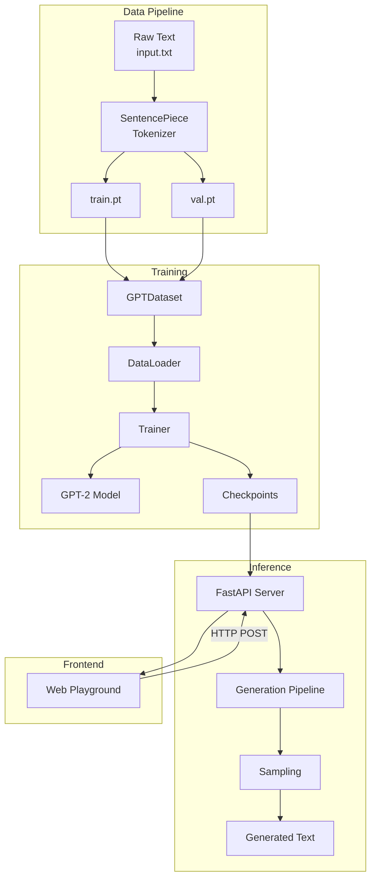

---

## Component Dependency Graph

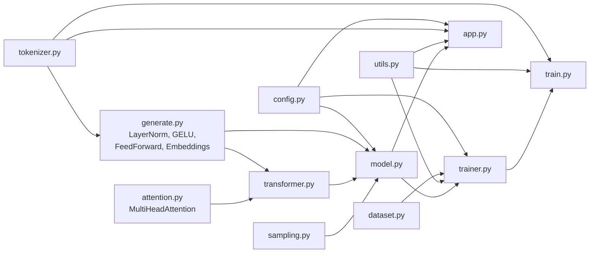

---

## Model Architecture

The model follows the GPT-2 architecture with **Pre-Layer Normalization** (Pre-LN). This means LayerNorm is applied *before* each sublayer, which improves training stability compared to the original Post-LN Transformer.

### Full Architecture Diagram

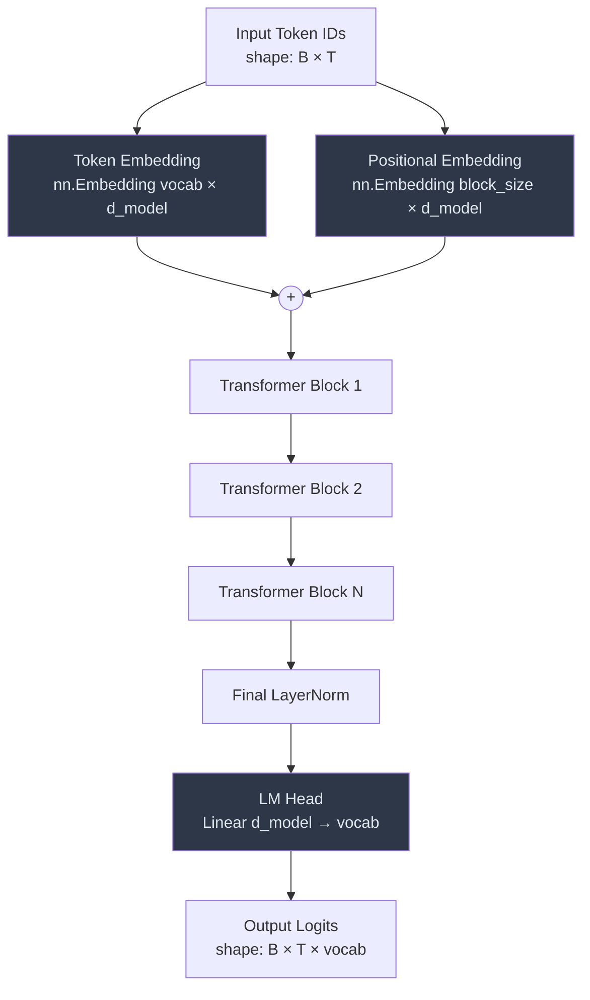

> **Weight tying**: `lm_head.weight` is set to the same parameter object as `wte.weight`, meaning the token embedding matrix is reused as the output projection. This reduces total parameter count and has been shown to improve language model quality.

---

### Token Embedding

**File**: `generate.py` — class `TokenEmbedding` (lines 58–65)

Wraps `nn.Embedding(vocab_size, embed_dim)`. Converts integer token IDs to dense vectors of dimension `embed_dim`.

```
Input:  [  42,  17, 831,   5 ]        shape: (B, T)
Output: [[ 0.12, -0.34, ...],         shape: (B, T, embed_dim)
         [ 0.56,  0.78, ...],
         [-0.23,  0.91, ...],
         [ 0.45, -0.67, ...]]
```

---

### Positional Embedding

**File**: `generate.py` — class `LearnedPositionEmbedding` (lines 68–77)

The default positional embedding uses a **learned** embedding table of shape `(block_size, embed_dim)`. Position indices `[0, 1, ..., T-1]` are mapped to dense vectors and added element-wise to the token embeddings.

A `SinusoidalPositionEmbedding` (lines 80–93) is also implemented but not used in the default model. It uses the standard sinusoidal formula from "Attention Is All You Need":

```
PE(pos, 2i)   = sin(pos / 10000^(2i/d_model))
PE(pos, 2i+1) = cos(pos / 10000^(2i/d_model))
```

---

### Multi-Head Causal Attention

**File**: `attention.py` — class `MultiHeadAttention` (lines 51–97)

This is the core attention mechanism. It implements **masked (causal) multi-head self-attention** with a combined QKV projection.

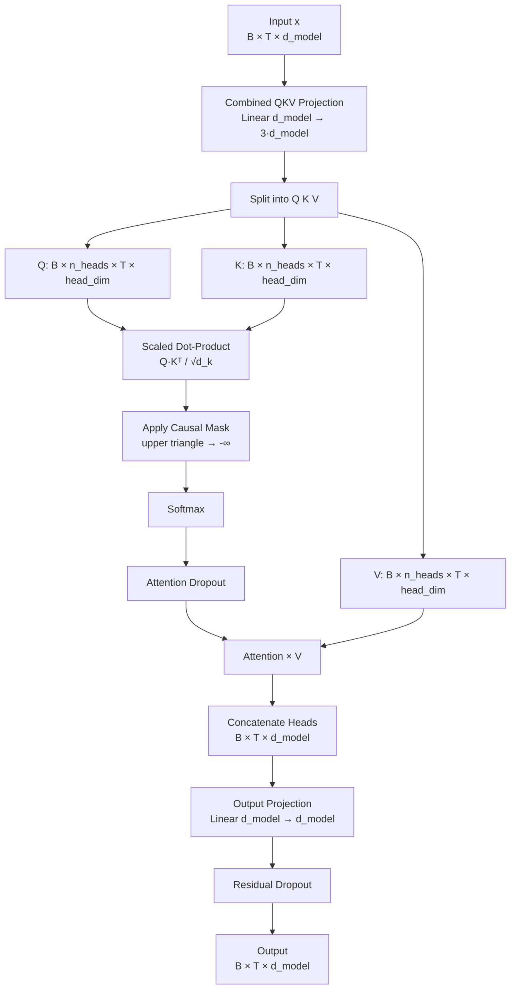

**Causal mask** (`create_causal_mask` in `attention.py`, lines 5–7): A lower-triangular matrix that prevents each position from attending to future positions. Implemented via `torch.tril`.

```
Mask for T=4:
[[1, 0, 0, 0],
 [1, 1, 0, 0],
 [1, 1, 1, 0],
 [1, 1, 1, 1]]
```

**Scaling**: Attention scores are divided by `√(head_dim)` to prevent softmax saturation for large embedding dimensions.

A `SingleHeadAttention` class (lines 30–48) is also implemented as a reference but is not used in the model. It uses separate projection matrices for Q, K, and V.

---

### Feed-Forward Network

**File**: `generate.py` — class `FeedForward` (lines 30–43)

A position-wise two-layer MLP with GELU activation and 4× inner expansion:

```
Input (d_model) → Linear (d_model → 4·d_model) → GELU → Linear (4·d_model → d_model) → Dropout → Output
```

The 4× expansion is standard in GPT-2 and allows the network to learn more complex transformations while keeping the residual stream dimension constant.

---

### Transformer Block

**File**: `transformer.py` — class `TransformerBlock` (lines 6–19)

Each block applies Pre-LN attention and Pre-LN MLP with residual connections:

```python
x = x + attn(ln_1(x))    # Attention sublayer with residual
x = x + mlp(ln_2(x))     # MLP sublayer with residual
```

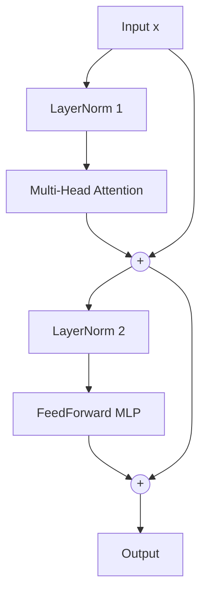

---

### Layer Normalization

**File**: `generate.py` — class `LayerNorm` (lines 11–21)

Custom implementation matching PyTorch's `nn.LayerNorm` behavior:

```
LayerNorm(x) = (x - mean(x)) / sqrt(var(x) + ε) * γ + β
```

- `γ` (weight): initialized to ones
- `β` (bias): initialized to zeros
- `ε`: 1e-5 (default)
- Uses `unbiased=False` variance (population variance, not sample variance)

---

### GELU Activation

**File**: `generate.py` — class `GELU` (lines 24–27)

Uses the **tanh approximation** of the Gaussian Error Linear Unit:

```
GELU(x) = 0.5 * x * (1 + tanh(√(2/π) * (x + 0.044715 * x³)))
```

This is the same approximation used in the original GPT-2 implementation.

---

### Residual Connections

Residual (skip) connections are used around both the attention and MLP sublayers. They allow gradients to flow directly through the network during backpropagation and enable training of deeper models.

A `ResidualBlock` helper class exists in `generate.py` (lines 46–53) but is not directly used — the `TransformerBlock` implements residual connections inline.

---

### Language Modeling Head

**File**: `model.py` — `self.lm_head` (line 22)

A linear projection from `d_model` to `vocab_size` without bias:

```
logits = Linear(x)    # shape: (B, T, vocab_size)
```

The weight matrix is **tied** to the token embedding weight (line 24), so there is no separate weight matrix for the LM head.

---

## Weight Initialization

**File**: `model.py` — `__init__` (lines 26–30)

All weights are initialized using a specific scheme:

| Module | Initialization |
|--------|---------------|
| `nn.Linear` weights | Normal(μ=0, σ=0.02) |
| `nn.Linear` biases | Zeros |
| `nn.Embedding` weights | Normal(μ=0, σ=0.02) |
| `c_proj.weight` (output projections) | Normal(μ=0, σ=0.02/√(2·N)) where N = number of layers |

The special initialization for `c_proj` follows the GPT-2 convention: the residual stream accumulates contributions from `2N` sublayers (N attention + N MLP), so each output projection's initial contribution is scaled down by `√(2N)` to maintain stable activations at initialization.

---

## Training Flow

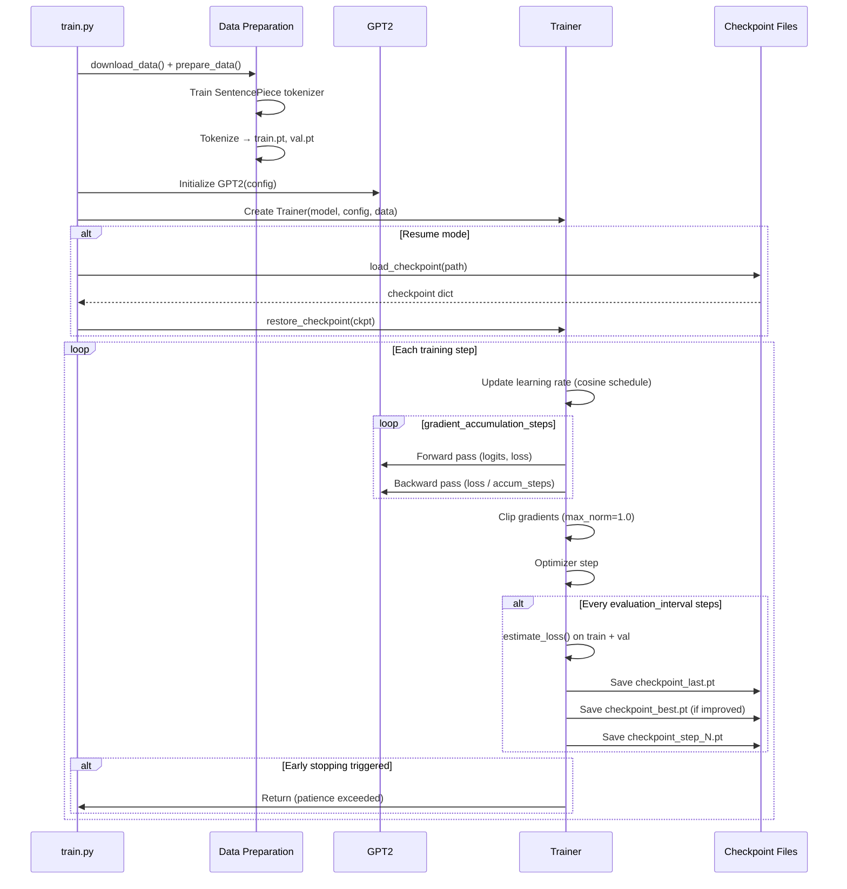

---

## Inference Flow

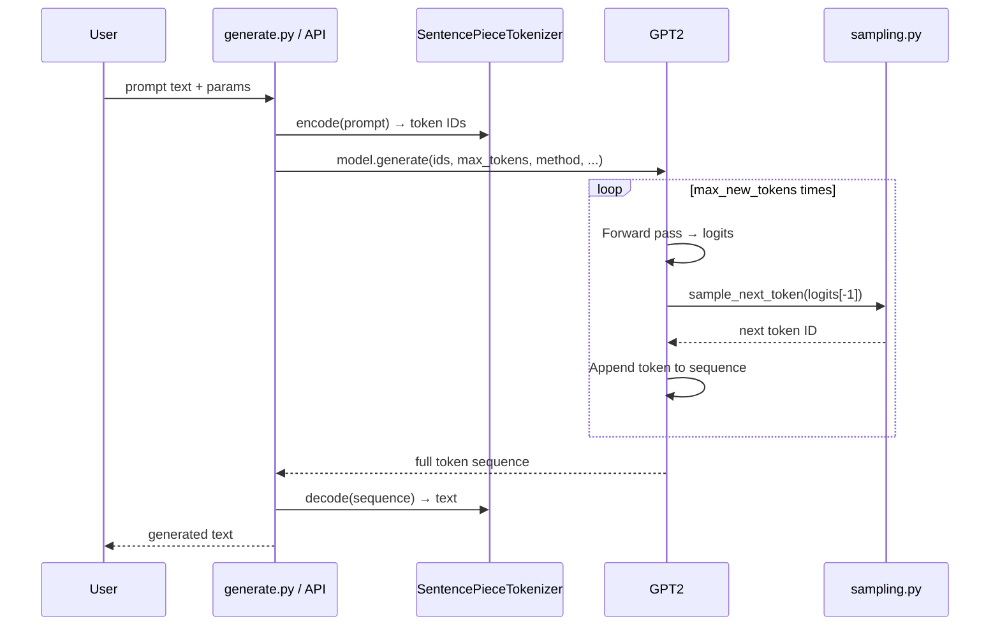

---

## Checkpoint Flow

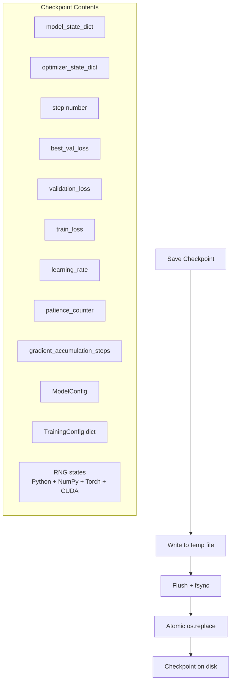

---

## FastAPI Flow

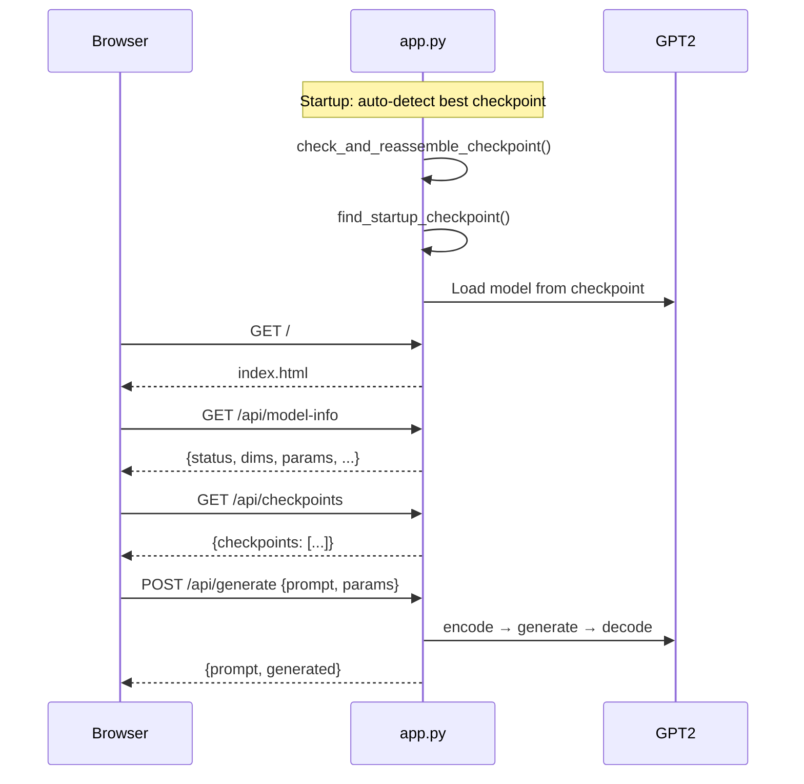

---

## Frontend Flow

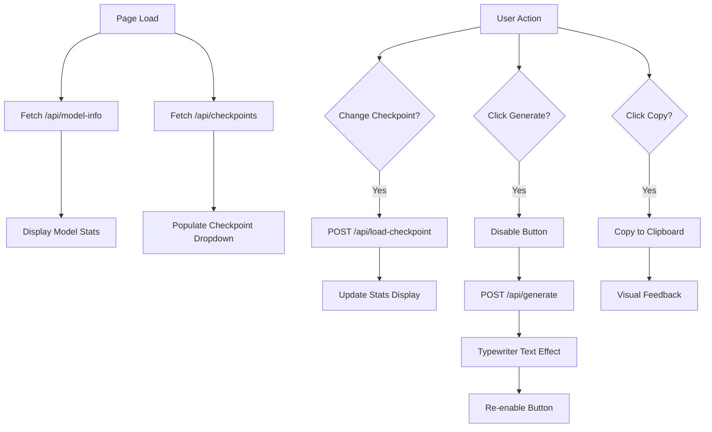

---

## Tokenizer

**File**: `tokenizer.py`

Two tokenizer implementations:

### SentencePieceTokenizer (Primary)

- **Algorithm**: Byte-Pair Encoding (BPE)
- **Vocabulary size**: 1,000 tokens
- **Character coverage**: 100%
- **Special tokens**:

| Token | ID | Symbol |
|-------|-----|--------|
| Padding | 0 | `<pad>` |
| Unknown | 1 | `<unk>` |
| Beginning of Sequence | 2 | `<s>` |
| End of Sequence | 3 | `</s>` |

- **Model file**: `data/processed/sp.model`
- **Vocabulary file**: `data/processed/sp.vocab`

### CharacterTokenizer (Alternative)

- Character-level tokenizer mapping each unique character to an integer
- Not used in the default pipeline
- Available for experimentation with smaller datasets

---

## Dataset Pipeline

**File**: `dataset.py`

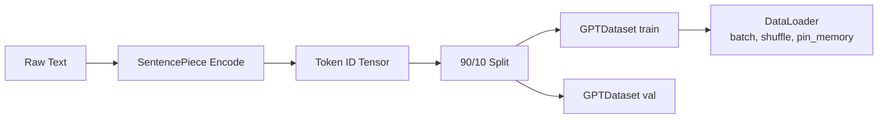

**`GPTDataset`**: Implements a sliding window over the token sequence. For each index `i`, returns:
- `x = tokens[i : i + block_size]` (input)
- `y = tokens[i+1 : i + block_size + 1]` (target, shifted by one position)

This is the standard next-token prediction setup for autoregressive language models.

---

## Sampling Pipeline

**File**: `sampling.py`

The generation pipeline supports four sampling strategies:

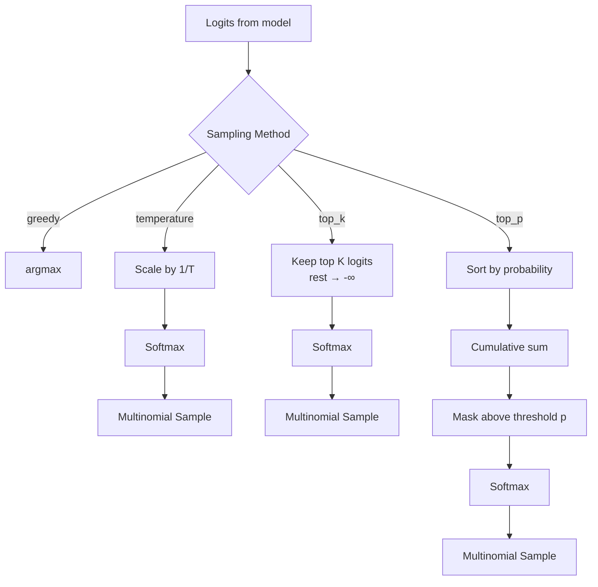

| Method | Parameter | Effect |
|--------|-----------|--------|
| `greedy` | — | Always selects the highest-probability token. Deterministic. |
| `temperature` | `temperature` (0, ∞) | Values < 1.0 sharpen the distribution (more conservative). Values > 1.0 flatten it (more creative). |
| `top_k` | `top_k` (int) | Only the top K most probable tokens are considered. |
| `top_p` | `top_p` (0, 1] | Keeps the smallest set of tokens whose cumulative probability exceeds p. |

---

## Module Reference

| Module | File | Key Classes/Functions | Purpose |
|--------|------|----------------------|---------|
| `ModelConfig` | `config.py` | `ModelConfig` dataclass | Model hyperparameters |
| `TrainingConfig` | `config.py` | `TrainingConfig` dataclass | Training hyperparameters |
| `GPT2` | `model.py` | `GPT2(nn.Module)` | Top-level language model |
| `MultiHeadAttention` | `attention.py` | `MultiHeadAttention`, `ScaledDotProductAttention`, `create_causal_mask` | Attention mechanisms |
| `TransformerBlock` | `transformer.py` | `TransformerBlock` | Single transformer layer |
| `Layers` | `generate.py` | `LayerNorm`, `GELU`, `FeedForward`, `TokenEmbedding`, `LearnedPositionEmbedding`, `SinusoidalPositionEmbedding`, `ResidualBlock` | Fundamental building blocks |
| `Sampling` | `sampling.py` | `sample_next_token()` | Decoding strategies |
| `Tokenizer` | `tokenizer.py` | `SentencePieceTokenizer`, `CharacterTokenizer` | Text tokenization |
| `Dataset` | `dataset.py` | `GPTDataset`, `get_dataloader()`, `create_datasets()`, `get_batch()` | Data loading |
| `Trainer` | `trainer.py` | `Trainer` | Training loop + checkpointing |
| `Training CLI` | `train.py` | `main()`, `prepare_data()`, `download_data()` | CLI entry point |
| `Generation CLI` | `generate.py` | `main()` | CLI text generation |
| `API Server` | `app.py` | FastAPI app, `GenerateRequest`, endpoints | REST API |
| `Utilities` | `utils.py` | `seed_everything()`, `save_checkpoint()`, `load_checkpoint()`, `count_parameters()`, `create_logger()` | Helper functions |
